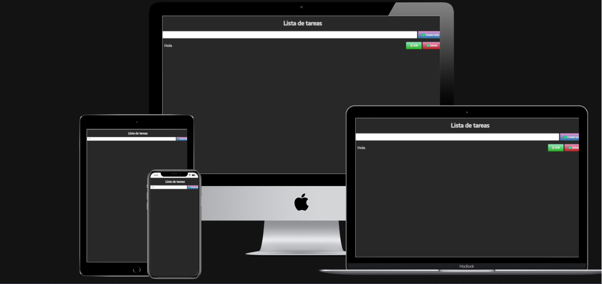

<!--markdownlint-disable MD041-->

# Lista de tareas

- In this repository you can find My Tasklist website.

## Built With

- HTML
- CSS
- Git
- JavaScript
- React

## Getting Started

**In this repository I created a functional tasklist.**

## Run it

Use the following steps to run this project locally:

- open the terminal

- get in the directory you want this folder to appear

- put: git clone `git@github.com:jeici21/lista-tareas.git`

- open the folder with a code editor (VS Code preferred)

- go to the index.html file and open it with live server

## Authors

👤 **Jorge Castro Vargas**

- GitHub: [@jeici21](https://github.com/jeici21)
- Twitter: [@cijei21](https://twitter.com/cijei21)
- LinkedIn: [Jorge Castro Vargas](https://www.linkedin.com/in/jorge-castro-vargas-7242a8129/)
- Facebook: [Jorge Castro Vargas](https://www.facebook.com/jeici21/)

## 🙏 Acknowledgements

[Vida MMR](https://www.youtube.com/@vidamrr) - Main source to develop this website.
